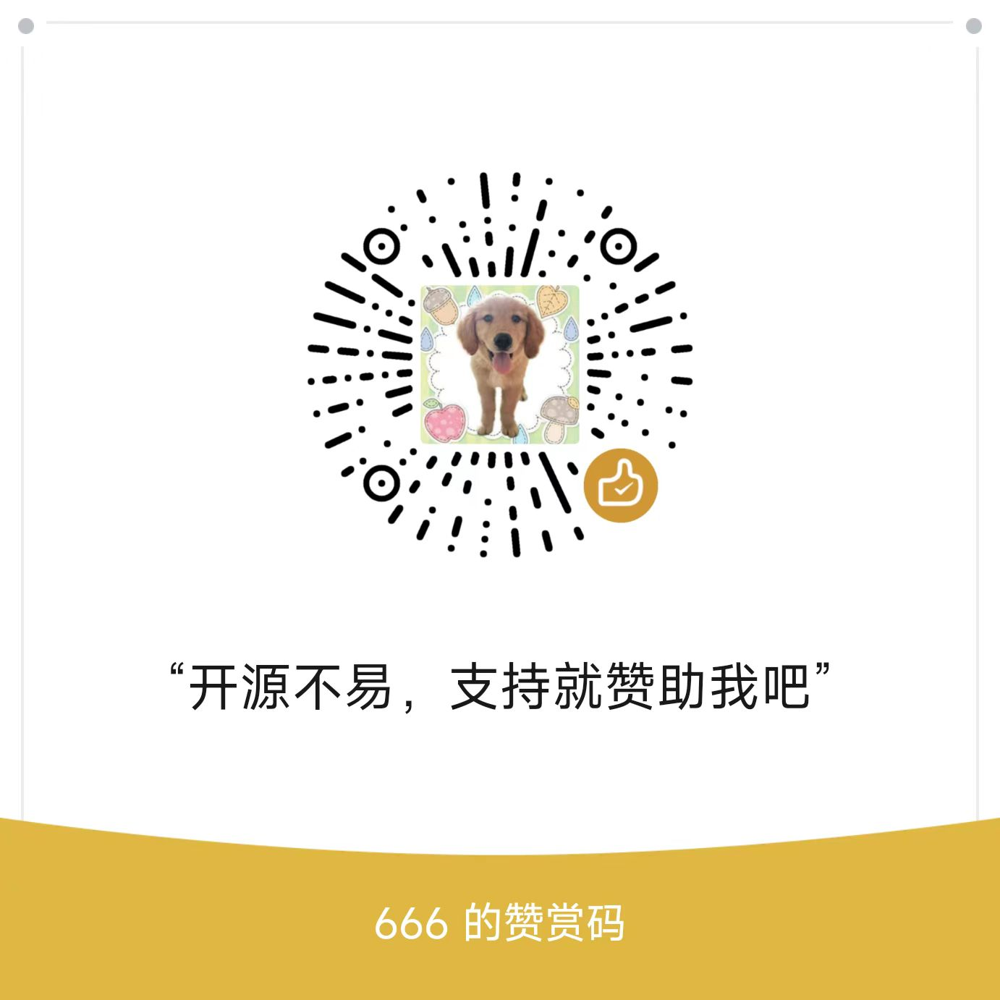

# lifeflow-logicflow-vue

基于规则引擎[liteflow](https://gitee.com/dromara/liteFlow)， 使用前端架构[LogicFlow](https://gitee.com/logic-flow/LogicFlow) 开发的前端配置页面。
通过页面配置生成json，交给后端生成EL表达式

## 对接步骤 
1. 先把上面前端跑起来，然后配置好流程之后，点击页面上的左上角“获取数据”的按钮，会在浏览器的Console打印了json, 获取这个logicFlow的json数据后
2. 运行后端代码 [liteflow-vue-api](https://gitee.com/dravin/liteflow-vue-api) 后，把刚刚的json请求接口：/api/generateLogicFlowEL 就可以解析出EL表达式

## 请客吗?

## 感谢

| 壕气老板 | 赞助时间 |  
| --- |  --- |
| 疯狂挖掘机 |  4月12日|
| K. |  4月12日|
| 源 |  3月20日|
| jjj |  3月20日|

	
